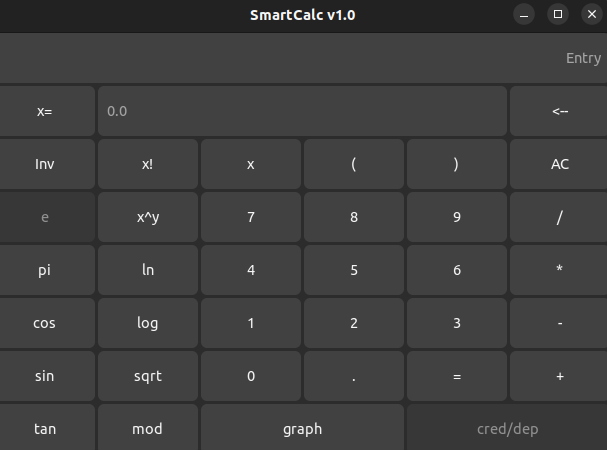
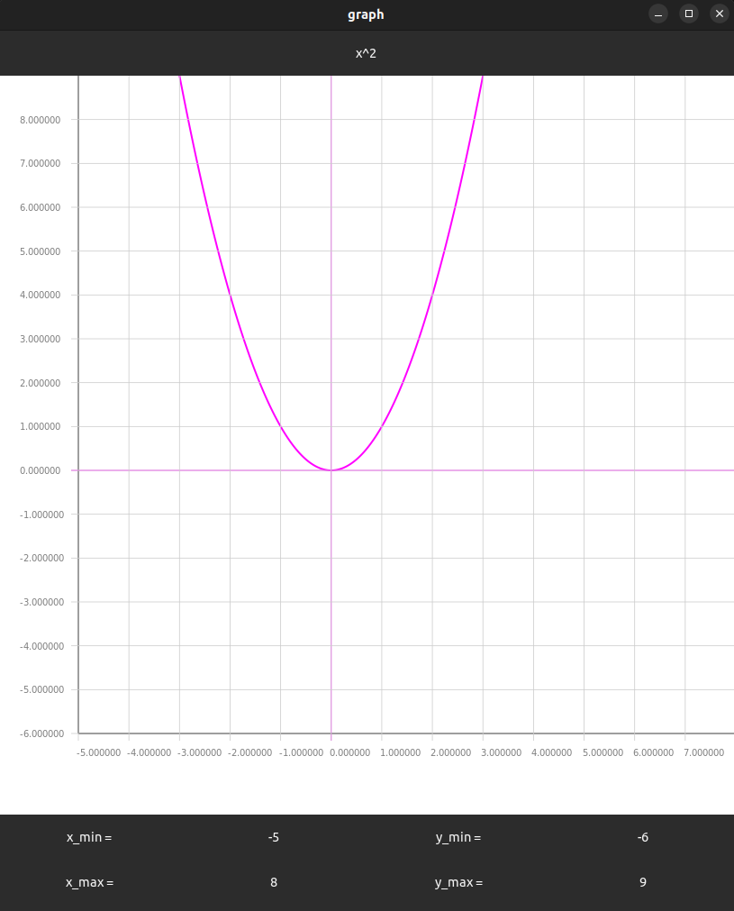

# SmartCalc v1.0

Implementation of SmartCalc v1.0.  
Tested on Ubuntu.  

## About

Program implemented on C with GTK4 GUI and Cairo for graph drawing module. Calculation modules made using Reverse Polish notation and covered with unit-tests using Check library.

Provides calculations for expressions with integer and real numbers from -1000000 to 1000000, or with the variable x as a number. Allowed expression lenght up to 255 characters. Tested accuracy is 7 decimal places. Also may draw graph for any allowed expression for specified limits.

Allowed arithmetic operators:

      | Operator name | Infix notation (Classic) |
      | --------- | ------ |
      | Brackets | (a + b) |
      | Addition | a + b |
      | Subtraction | a - b |
      | Multiplication | a * b |
      | Division | a / b |
      | Power | a ^ b |
      | Modulus | a mod b |
      | Unary plus | +a |
      | Unary minus | -a |

Allowed functions:

      | Function description | Function |
      | ------ | ------ |
      | Computes cosine | cos(x) |
      | Computes sine | sin(x) |
      | Computes tangent | tan(x) |
      | Computes arc cosine | acos(x) |
      | Computes arc sine | asin(x) |
      | Computes arc tangent | atan(x) |
      | Computes square root | sqrt(x) |
      | Computes natural logarithm | ln(x) |
      | Computes common logarithm | log(x) |

  

  

## Install && Run || Uninstall

Required packages: 

`sudo apt install build-essential`  
`sudo apt install libgtk-4-dev`  
`sudo apt install libcairo2-dev`  

Use makefile targets:

`make install`  
`make run`  
`make uninstall`  

## Other targets

`make clean`  
`make dvi` - Texinfo package required  
`make dist`   
`make test` - Check package required  
`make gcov_report` - Gcovr package required  
